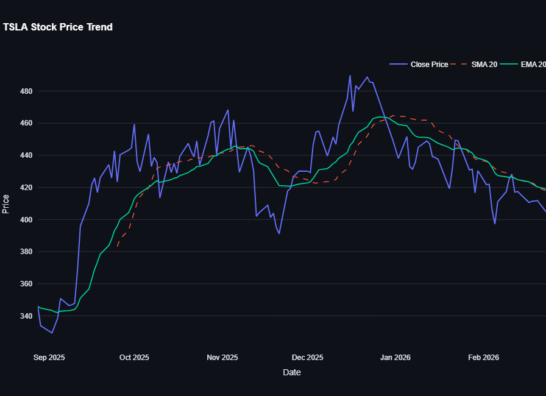

# 📈 Real-Time Stock Market Dashboard

An interactive stock analytics dashboard built using Python, Streamlit,
SQLite, and Plotly. This application fetches global stock market data,
stores it locally in a database, and provides analytical insights with
technical indicators and performance metrics.

------------------------------------------------------------------------

## 🚀 Features

-   Interactive stock price visualization
-   Global stock support (US, India, Crypto, Indices)
-   Local SQLite database storage
-   20-day Simple Moving Average (SMA)
-   20-day Exponential Moving Average (EMA)
-   Key metrics (Latest Price, Volume, Percentage Change)
-   Performance summary (Average, High, Low, Volatility, Total Return)
-   CSV data download option
-   Expandable raw data viewer

------------------------------------------------------------------------

## 🌐 Live Demo
https://stock-market-dashboard-pandas-plotly.streamlit.app/

------------------------------------------------------------------------

## 🏗 System Architecture

User Input (Streamlit UI) → Yahoo Finance API (yfinance) → SQLite
Database (Raw Data Storage) → Analytics Layer (Pandas Indicators) →
Interactive Visualization (Plotly)

Project Structure:

-   app.py → User Interface and application flow
-   database.py → Database management (Object-Oriented design)
-   data_fetcher.py → API data retrieval logic
-   indicators.py → Technical indicator calculations

------------------------------------------------------------------------

## 🛠 Tech Stack

-   Python
-   Streamlit
-   SQLite
-   Pandas
-   Plotly
-   yfinance

------------------------------------------------------------------------

## ▶ Installation & Usage

1.  Clone the repository:

git clone https://github.com/nabeelrehman120604/stock-market-dashboard.git cd
stock-market-dashboard

2.  Install dependencies:

pip install -r requirements.txt

3.  Run the application:

streamlit run app.py

The dashboard will open automatically in your browser.

------------------------------------------------------------------------

## 📊 Supported Symbol Examples

US Stocks: AAPL, TSLA, MSFT Indian Stocks: RELIANCE.NS, TCS.NS Crypto:
BTC-USD Indices: \^GSPC

------------------------------------------------------------------------

## 📷 Dashboard Preview

------------------------------------------------------------------------

## 📌 Future Improvements

-   Multi-stock comparison
-   Additional technical indicators (RSI, MACD)
-   Cloud deployment
-   Performance optimization for large datasets

------------------------------------------------------------------------

## 📄 License

This project is licensed under the MIT License.
